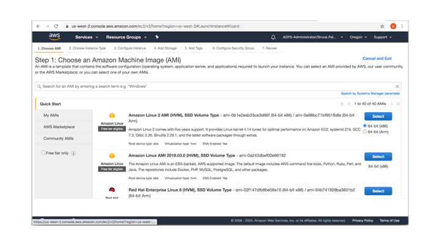
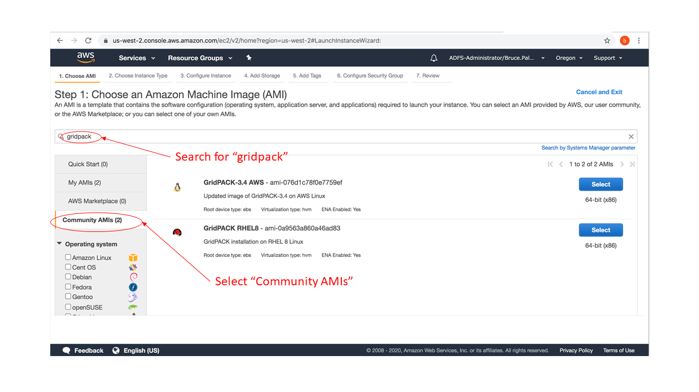
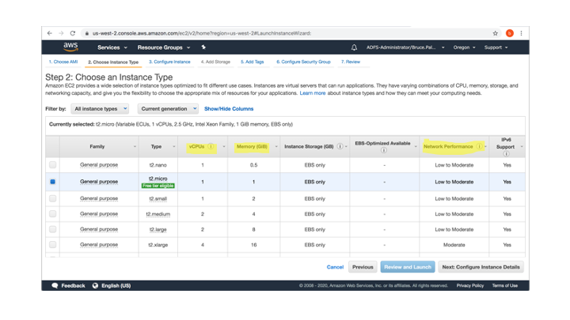
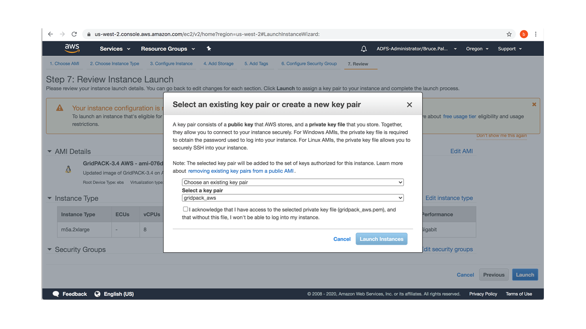
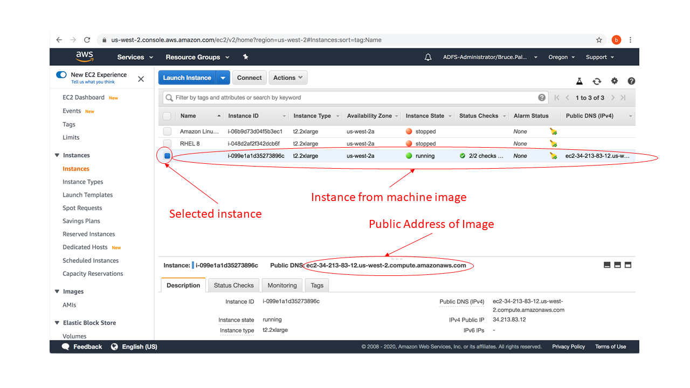
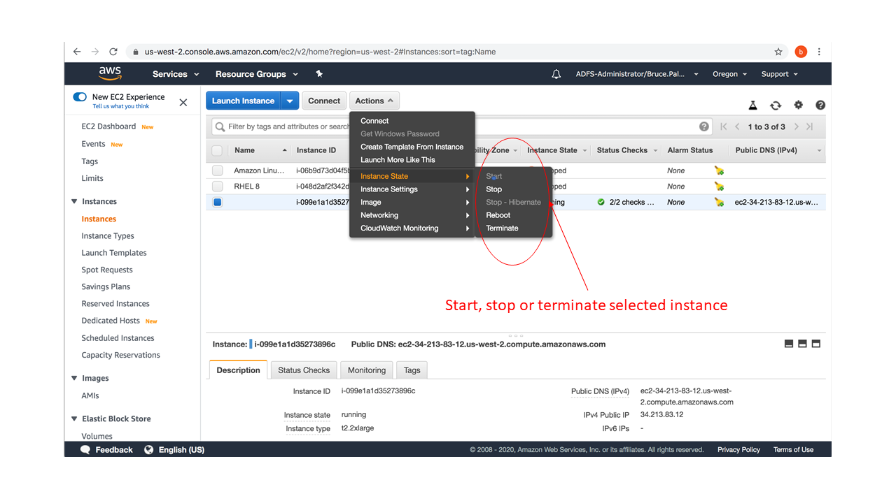

This capability is under development.

The GridPACK development team is currently working on making GridPACK available
through the cloud. The reasons for doing this are twofold. One is to reduce the
overhead of getting started with GridPACK by providing an out-of-the-box build
that can be used immediately by anyone interested in investigating GridPACK or
trying out some of its applications and features. The second reason is to make
GridPACK available to users that do not currently have access to Linux
workstations or clusters or would like to see what can be accomplished with
these kinds of resources before making the investment in setting up a Linux
system.

Once you have created an instance of GridPACK on the cloud from a machine image
file, it behaves exactly like a remote Linux computer and you can access it
using the same kinds of methods that you would use to access any other Linux
workstation or cluster. The current GridPACK images come preloaded with the VI
editor and GNU compilers. It also comes with git, sftp, scp and svn, so any
development you do can eventually be transferred to some other platform. Other
packages can be installed with yum. You will have sudo privileges on any
instance you create so it is possible to configure it to suit your preferences.
The GridPACK images contain two directories. The `software` directory
contains all the libraries needed by GridPACK, including PETSc, Boost, GA, and
MPI. The GridPACK directory contains all of the GridPACK source code as well as
two builds of GridPACK. The builds are located in GridPACK/src/build_ts and
GridPACK/src/build_pr. Inside each of these directories is an
`install` directory that can be linked to by new GridPACK
applications. The build_ts and build_pr are built using the two-sided and
progress rank runtimes of GA, respectively. The two-sided build is probably
sufficient for most runs using small numbers of processors, the progress ranks
build should be used when running on large numbers of processors.

### Amazon Web Services:
At present, GridPACK is only available through Amazon Web Services (AWS). The
GridPACK development team is new to this type of computing environment and we
encourage any users that run into difficulties to contact the development team.
We will try and provide further clarification or make appropriate changes to our
cloud distribution so that GridPACK will work properly. Our access to AWS is
through a corporate account and we may have a different experience from users
accessing the cloud from other environments. Again, if you are having problems
and the instructions below do not appear to correspond with what you are seeing
when you log in, please contact us and we will try and resolve whatever issues
you may be having.

To use GridPACK via AWS it is first necessary to get an Amazon account. Once
users have set up an AWS account and logged in they should end up on the AWS
Management Console page.


This page will list a variety of AWS services available to users. Before doing
anything else, you need to make sure that you are using the correct service
area. In the upper right hand side of the page on the service bar there is a
pull down-menu with a location on it (a state, e.g. "Ohio" or possibly a city,
e.g. "Tokyo"). Make sure that this is set to
"US West (Oregon) us-west-2". If you have never logged in before or want to
create a new instance from a GridPACK Amazon Machine Image (AMI), go to the
"Build a solution" box and click on the "Launch a virtual machine" link (it will
also mention EC2).

### Finding and Launching an Amazon Machine Image
If you clicked on the "Launch a virtual machine" link you will end up an a page
titled ("Step 1: Choose an Amazon Machine Image (AMI)").



Select "Community AMIs" from the list on the left hand side and type in
"gridpack" in the search field at the top. You should see some GridPACK AMIs.



Select one of these images. The main difference between the different images is
the operating system they represent. When you select one of these images, a page
will pop up that asks you to select a hardware configuration on which to run
your instance.



The different hardware configurations offer different numbers of processors,
different amounts of memory and different speeds for network communication.
Generally, the more CPUs (vCPUs) and the higher the network performance, the
more expensive the configuration will be. The t2.micro
configuration is free, but we have found that it is too small to work with. The
default amount of memory for smaller instances is generally inadequate for
GridPACK and should be increased significantly. This can be done when
configuring the system.

After selecting the configuration, click the "Next: Configure Instance Details"
button at the bottom of the page. This page can be left as is, as long as a
network appears in the Network block. Depending on how your account is
configured, there may be more than one network or subnet available. We have both
private and public subnets available. This example will use a public subnet.

After selecting a network, go to the bottom of the page and click on the "Next:
Add Storage" button. Set the "Size (GiB)" field to at least 30 GiB. Then click
on "Review and Launch" at the bottom of the page. Next click on the "Launch"
button at the bottom of the page.


A dialog box will pop up asking you to "Select an existing key pair or create a
new key pair". If you have created a key pair in the past, you can choose an
existing key pair.
If you have used AWS in the past, you may already have a key file available. If
so you can go to the "Select a key pair menu" and choose one of them. Otherwise,
you will need to select the "Create a new key pair" option in the upper menu and
follow the instructions for creating a key file. Make sure to store the
resulting .pem file where it won't get lost or deleted, otherwise you will not
be able to access your instance.



Once the key file has been selected, check the
box acknowledging that you have access to the key file and then click on the
"Launch Instances" button. Go to the bottom of the page and click on the "View
Instances" button. This will take you to a page listing your instances.



Your newly created instance should show on this page. You can give the instance
a name by mousing over the instance name field and clicking on the pencil icon.
The instance may take a few minutes to start up but eventually it will show as
running in the "Instance status" field. At this point it is ready for use. Once
you have created an instance, you cannot change its size without first saving it
as an AMI and then starting a new instance from that AMI.

Once an instance has been created, you can start and stop it repeatedly by
selecting the instance, going to the "Actions" menu and clicking "Start" or
"Stop" under the "Instance State" submenu. Any files that you create on a
running instance will be retained if you stop the instance and will be available
the next time you restart it.



If you want to get rid of an instance entirely, you can select "Terminate". This
will completely remove the instance and destroy all files, so make sure that
anything that needs to be saved has been pushed to a repository or has been
copied to another system.

If you selected a public subnet when configuring the instance, then each time
you start an instance, a machine name appears in the "Pubic DNS" field or and IP
address appears in the "Public IP" field for that instance. Either the machine
name or the IP address can be used to SSH into the running instance from some
other computer. (If you use a private subnet, you may only see a private IP
address). Note that every time you restart an existing instance, you will get a
new IP address. Once an instance is running and has an IP address, it can be
accessed from another computer just like any Linux workstation or cluster. When
you first create an instance, it will always have an account called "ec2-user".
This user name can be used to log into the instance. You can use your privileges
as superuser to add other user accounts, if desired. If you are using your
instance to develop your own applications and decide that you want to use a
different sized instance, or perhaps you want to share it with others, you can
save your instance as an AMI and then create a new instance from it on a
different sized virtual machine. You can also create AMIs as a way to save your
work, although you should also want to look at tools such as git to make
a permanent record of your code development.

There are a number of ways to access an instance once it is running. A few are
listed below.

### From Linux:
This is the simplest platform to use to log into your AWS instance. Copy the key
pair file that you are going to use to a directory on your Linux platform that
you would like to use for logging in to the AWS instance. Change the permissions
on the file using the command

```
    chmod 600 keyfile.pem
```

where `keyfile.pem` is the key pair file name. SSH will not allow
you to use a key file that is world readable. Then type

```
    ssh -i keyfile.pem -l ec2-user ip.add.re.ss
```

where `ip.add.re.ss` is the numerical IP address in the "Public IP"
field on the EC2 Dashboard page. This will log you in as user ec2-user. You can
also use the public DNS name.

### From a Mac:
Accessing an instance from a Mac is almost the same as for a Linux box. Bring up
a terminal on the Mac and go to whatever directory contains your key pair file.
Use the above SSH command to connect to the remote instance after changing the
permissions on the key pair file.

### From Windows:
A running instance can be accessed using Putty. A detailed description on how to
do this is available
[here](http://docs.aws.amazon.com/AWSEC2/latest/UserGuide/putty.html). To use
Putty you will need to download both the putty and puttygen executables. These
are both freely available from the [Putty website](http://www.putty.org/).

Instances can also be accessed using [Cygwin](https://www.cygwin.com/). After
installing Cygwin, bring up a Cygwin window. This will behave largely like a
Linux terminal. We will assume that the .pem file created when you started your
AWS instance is located somewhere on your Windows desktop. If you just type
`ls` to get a directory listing, you will see a variety of directories
such as `Desktop`, `Downloads` etc. that mimic the folders on
Windows. At least initially, these folders will not have anything in them. To
find the .pem file, type `df` in the Cygwin window. You will probably see
something like

```
    Filesystem     1K-blocks      Used Available Use% Mounted on
    C:/cygwin64    209712124 205861652   3850472  99% /
    U:             524284924 390740552 133544372  75% /cygdrive/u
```

Your Windows desktop and other folders are located under the partition
`/cygdrive/u`. If you type `cd /cygdrive/u` and then type
`ls` you will again see a listing of folders such as `Desktop`,
`Downloads` etc. but this time they will actually correspond to your
Windows folders. cd into the folder containing the .pem file and change the
permissions on the .pem file using `chmod 600 keyfile.pem`. Use ssh as
described above to log into your running instance.

### AWS Accounts:
Information on setting up an AWS account can be found
[here](https://aws.amazon.com/premiumsupport/knowledge-center/create-and-activate-aws-account/)
and information on billing can be found
[here](http://docs.aws.amazon.com/awsaccountbilling/latest/aboutv2/edit-payment-method.html).
Additional information on the properties of different instances can be
found [here](https://aws.amazon.com/ec2/instance-types/). The properties page
also has some information about setting up a free trial account with AWS.
